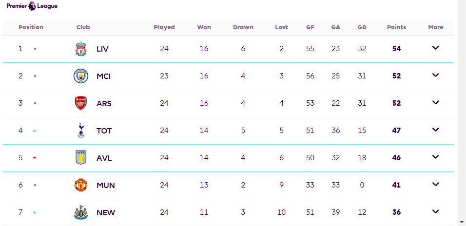
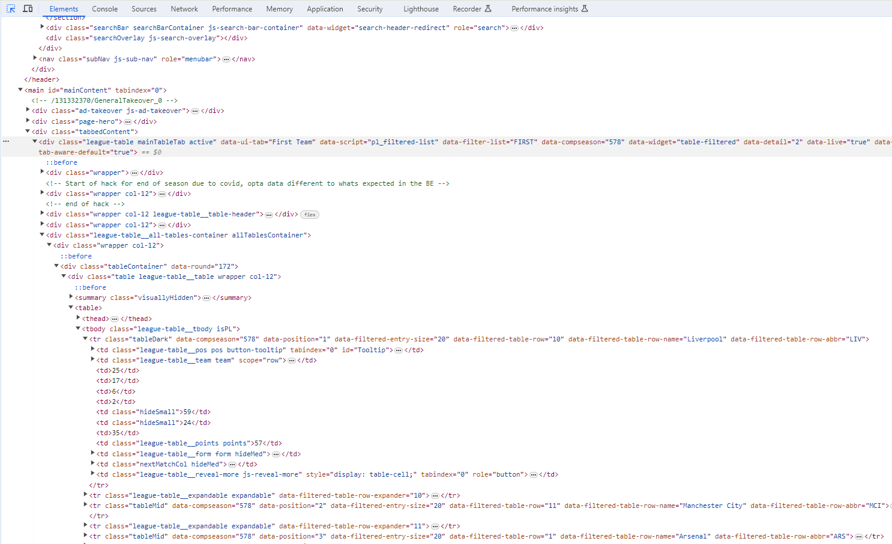
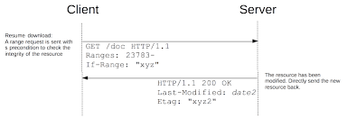
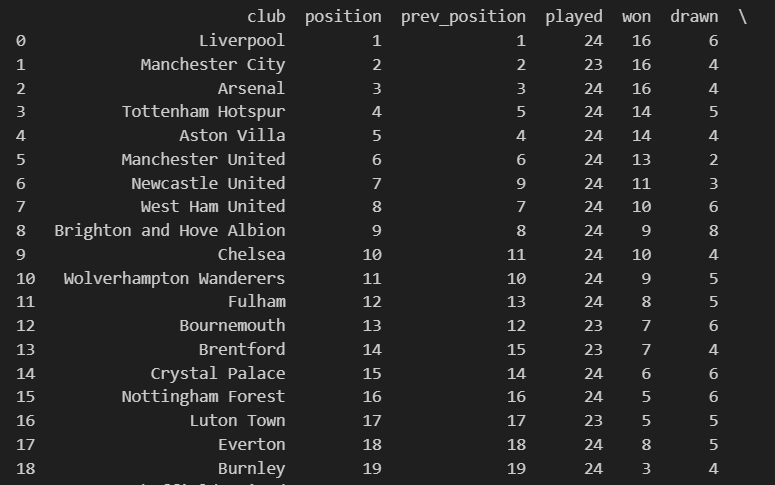
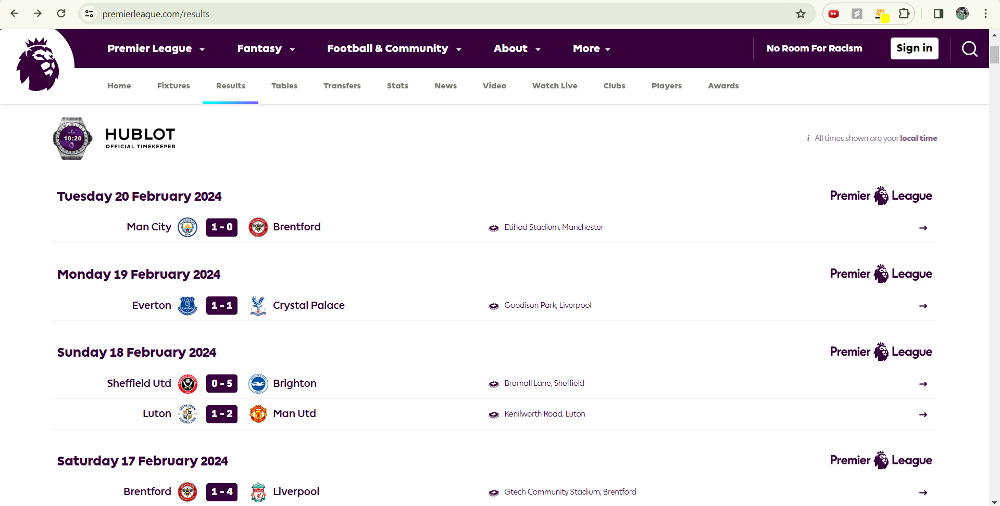

# What is Web Scraping?

## Web Scraping Background

-   **Web scraping**: programmatically gathering data from web-based sources
- Premade datasets:
    - Kaggle, GitHub, data.gov, etc.
    - May or may not contain what you need
- Websites contain **huge amounts of data**
    - Format is a barrier of access
    - Data displayed in UI
        - Elements of complex webpages
- Web scraping used to **unpack data from webpages**

## Why Web Scraping is Useful

## Static vs. Dynamic
- Static webpages:
    - Content will not change
- Dynamic webpages:
    - Content can be altered, loaded, etc. with JavaScript
    - Common with modern websites
- Methods to interact with both kinds
- Combination of both can be used

# Static Web Scraping

## Static Web Scraping
- Content is static
    - All HTML is already loaded in
    - We can parse through a static DOM object

**Python Libraries**

- **Requests**: HTTP Requests
- **BeautifulSoup**: Parsing HTML content
    - Our main focus with static web scraping
- **Pandas**: Loading dataset into a dataframe
    - Used in next steps in DS pipeline
    - Useful for further data manipulation an analysis

## Using Requests

- HTTP requests
    - Simplified: client makes a call to a server for an action
    - GET, POST, DELETE, etc.
- Requests is easiest way for HTTP requests in Python
- We use **GET request** to retrieve static HTML content
    - HTML retrieved is a snapshot
    - Response also gives other metadata
        - Status code, content type, etc.

## Using BeautifulSoup

- Output of requests --> Input of BeautifulSoup
- Used to **parse HTML and XML**
- Document Object Model (DOM)
- Hierarchical structure of HTML
    - We use this hierarchy to access elements

## Accessing Elements with BeautifulSoup
- Pass HTML into html.parser
- soup_object.tag
- Navigating down: accessing elements' children
    - .contents, .children
- Navigating up: accessing elements' parents
    - .parent, .parents
- find_all(filters: str | True | function | list | regex expr)
    - Returns descendants matching the filters
- select(CSS Selector)
- For full documentation: https://beautiful-soup-4.readthedocs.io/en/latest/#

## Using Pandas

- We will use briefly here, but it is extremely important for next steps
- DataFrame: 2-dimensional data structure that holds data similarly to an excel table or a SQL table
- We will create one for each of our web scraped datasets

# Dynamic Web Scraping

## Dynamic Web Scraping
- Website may require user interaction
- JavaScript may be used at runtime to change elements on the page as a response to user interaction
- Need a way to automate users interacting with the site
- Image below: lazy loading, not all data present when screen loads

## Selenium

- Use WebDriver API to launch a web browser instance
- Can interact with the web browser dynamically through code
- Headless: can run browser with UI shown or not shown (headless)
    - Can alter functionality, but headless can save resources
- Once interacted with, we can retrieve HTML content and use BeautifulSoup

## Retrieving Data with Selenium
- find_element()
    - Pass in By.Method where Method is what type of criteria to search for
- Explicit and implicit waits
- Expected conditions
- ActionChains

## Resources
- requests: https://requests.readthedocs.io/en/latest/
- Beautiful Soup 4: https://beautiful-soup-4.readthedocs.io/en/latest/
- pandas: https://pandas.pydata.org/docs/
- Document Object Model (DOM) https://developer.mozilla.org/en-US/docs/Web/API/Document_Object_Model
- HTTP: https://www.ibm.com/docs/en/cics-ts/5.3?topic=protocol-http-requests
- Selenium: https://selenium-python.readthedocs.io/
